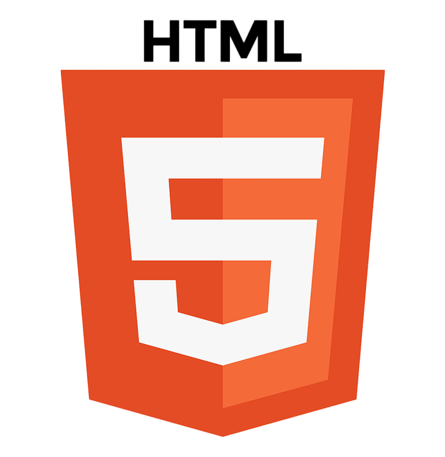
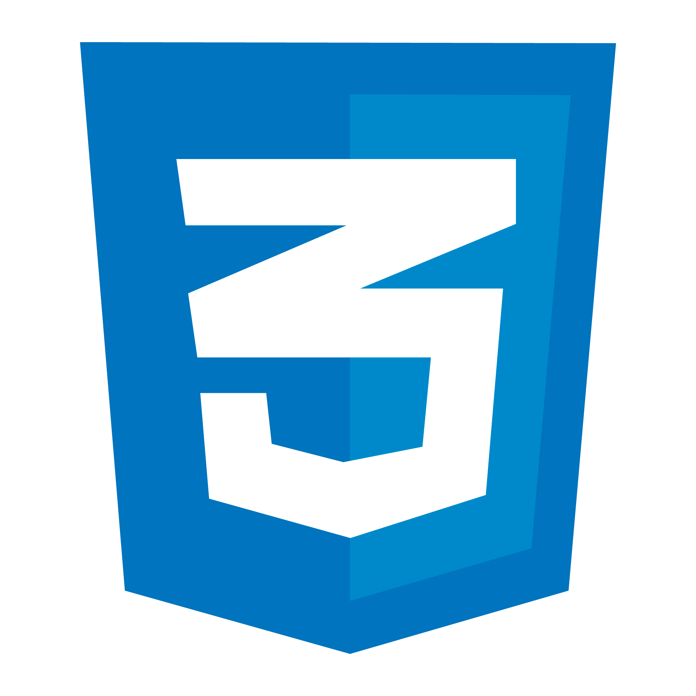
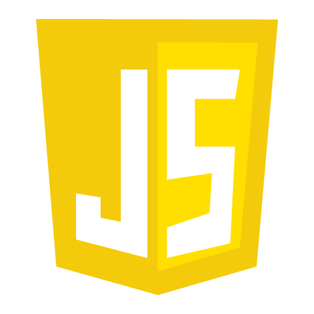
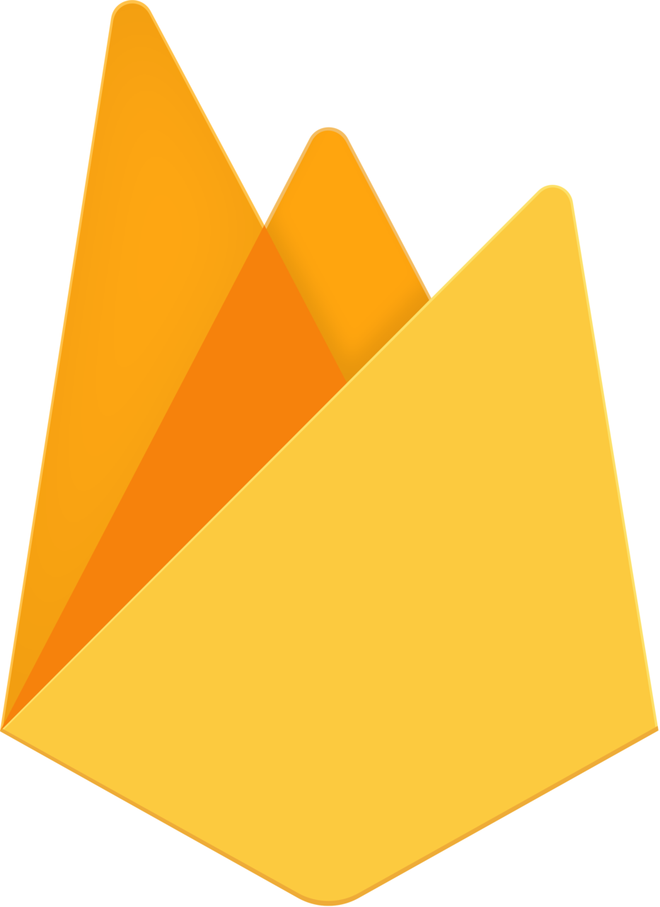
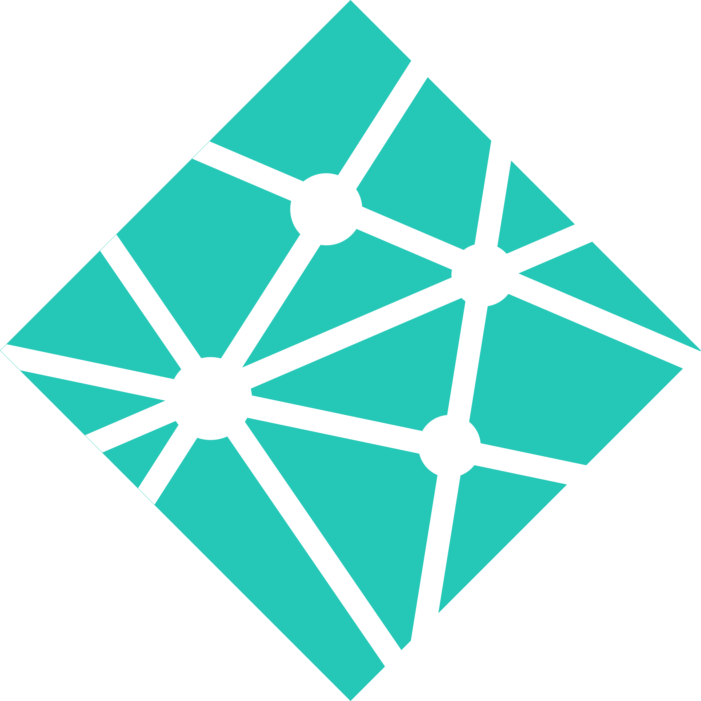
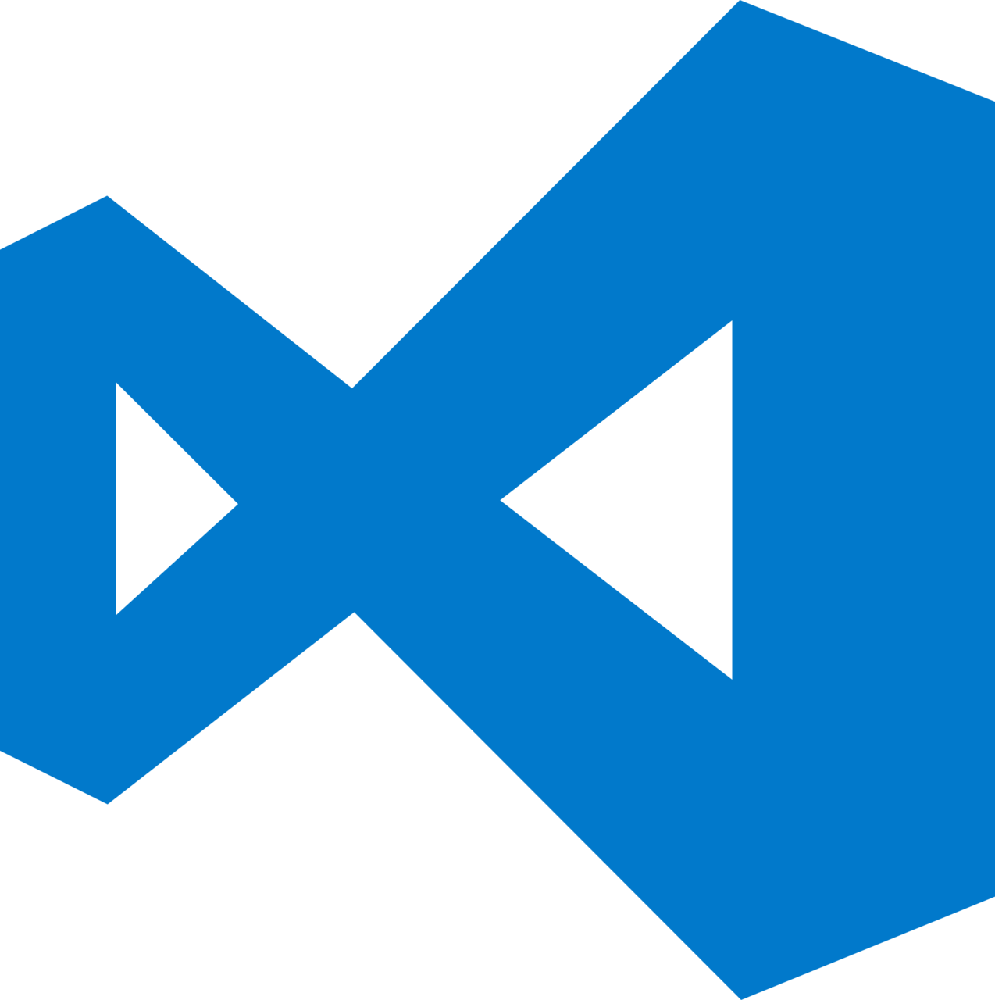
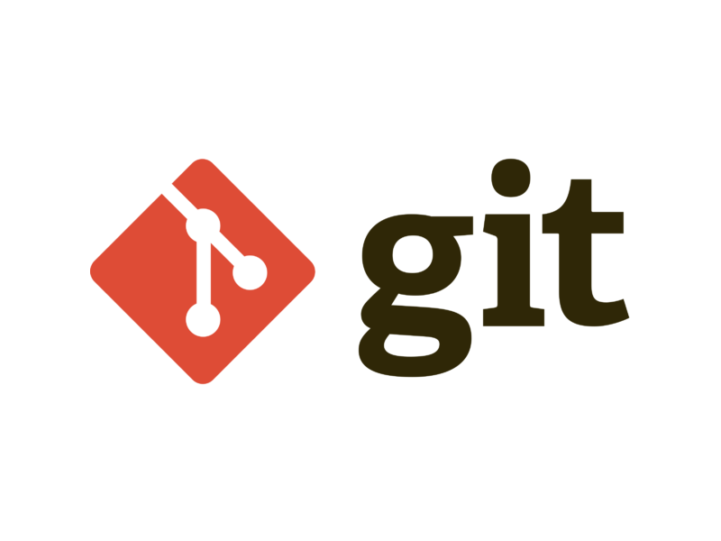

# Hi, I'm GlacioFrgas 👋  

💻 Hobbyist Developer  
I enjoy coding as a hobby and building small projects for fun (and sometimes for my sister 😊).

---

## 👤 About Me

- 🎂 **Birthday:** 5 July
- 📍 **Location:** Meerut, India
- 🎓 **Status:** Student & Hobbyist Developer
- 💡 **Interests:** Web Development, UI Design, Creative Coding

---

## 🧠 Languages & Tools I Know

  
  
  
  
  
  
  
  
  
  
  
  
  
  
  
  
  
  

---

## 🚀 What I Do

- Build frontend projects for practice  
- Create fun UI designs  
- Experiment with modern web tools  
- Learn new technologies step by step

---

## 📌 Current Focus

- Improving my frontend development skills  
- Building creative personal projects  
- Learning more about modern frameworks

---

## ⚡ Fun Fact

I started coding as a hobby and enjoy turning ideas into real websites.

---

## Portfolio News!

Guys, Our portfolio will be live when we will upload 10 projects successfully on Github.

---

⭐ Thanks for visiting my profile!
